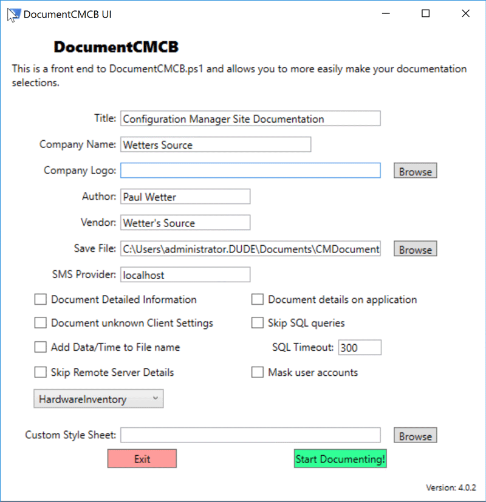

# DocumentCMCB

This is a nearly full rewrite of the System Center Configuration Manager (SCCM) documentation script so kindly shared with everyone by David O'Brien (@davidobrien1985, Twitter:@david_obrien).

I am attempting to document most everything in Current Branch.

The requirement for Microsoft Word has been dropped in favor of a pure formatted HTML output.

Please submit issues if you find a bug or have ideas on additional data that should be collected.

**Note:**  This has not been tested against an environment with a CAS or secondary sites.  But, most of us should not be running a CAS or secondary site in the age of Current Branch.

My updated script contains pretty much everything collected from the original.  Below is a summary of what’s New:

* Removed dependence on Microsoft Word.  
* Formatted HTML output.  
* Updated to work with Current Branch (1710+).  
* Collects everything for Software Updates (ADRS, Config, Packages, Groups)!!  
* Collects important Info for SQL database.  
* Collects Site features and servicing history.  
* Collect configuration of all discovery methods.
* Collect Default Boundary Group settings.  
* Extended to include configuration of all the new Client Settings.
  * Now inclues the default client settings.
* Collects additional Collection information.  
* Summarizes Collections with maintenance windows.
* Summary of all the different Compliance settings (Conditional Access, Company resources, etc).  
* Updated Endpoint Protection Profile info.  
* MUCH more detail on Applications (updated to everything included through 1906 - version 3.46).  
* Added OSD Related Items (Installers, Images, Upgrade Packages)  
* Lists Task Sequence steps.  
* Summary or detailed options.  
* CM Scripts
* VPN boundaries
## 4.0 Additions
* **New UI added in Version 4.0!!!**
* Co-Management Settings
* 4.0 Script now defaults to collect site system information from Hardware inventory instead of WMI.
  * Use parameter `-RemoteDetailsSource <WMI|HardwareInventory>`

## Script Usage Examples

### EXAMPLE 1

Run without any parameters specified, this will trigger the UI:  
 ```DocumentCMCB.ps1```
#### UI
When launched without any parameters, this UI will launch.  From here, you can configure the script to run as you see fit.  Note that most options have help text when you hover over them.


### EXAMPLE 2

This will document everything with detailed information.  Will make a very large file!  
 ```DocumentCMCB.ps1 -ListAllInformation -CompanyName "Acme Inc."```

### EXAMPLE 3

This will document everything with detailed information. It will also embed a custom logo from the provided URL into the cover page.  
 ```DocumentCMCB.ps1 -CompanyName "Acme Inc." -CompanyLogo 'http://www.contoso.com/logo.jpg' -ListAllInformation```

### EXAMPLE 4

This will document everything with summary information, a custom logo, and a custom Author and Vendor.  
 ```DocumentCMCB.ps1 -CompanyName "Contoso" -CompanyLogo 'http://www.contoso.com/logo.jpg' -Author "Bugs Bunny" -Vendor "Acme"```

### EXAMPLE 5

This will document everything with detailed information, a local custom logo, and a custom Author and Vendor.  This will also mask user accounts and add a date/time to the output file name.  This is a good option for automation of this script.

 ```DocumentCMCB.ps1 -ListAllInformation -CompanyName "Acme Inc." -CompanyLogo 'C:\Temp\logo.jpg' -Author "Bugs Bunny" -Vendor "Acme" -AddDateTime -MaskAccounts```
